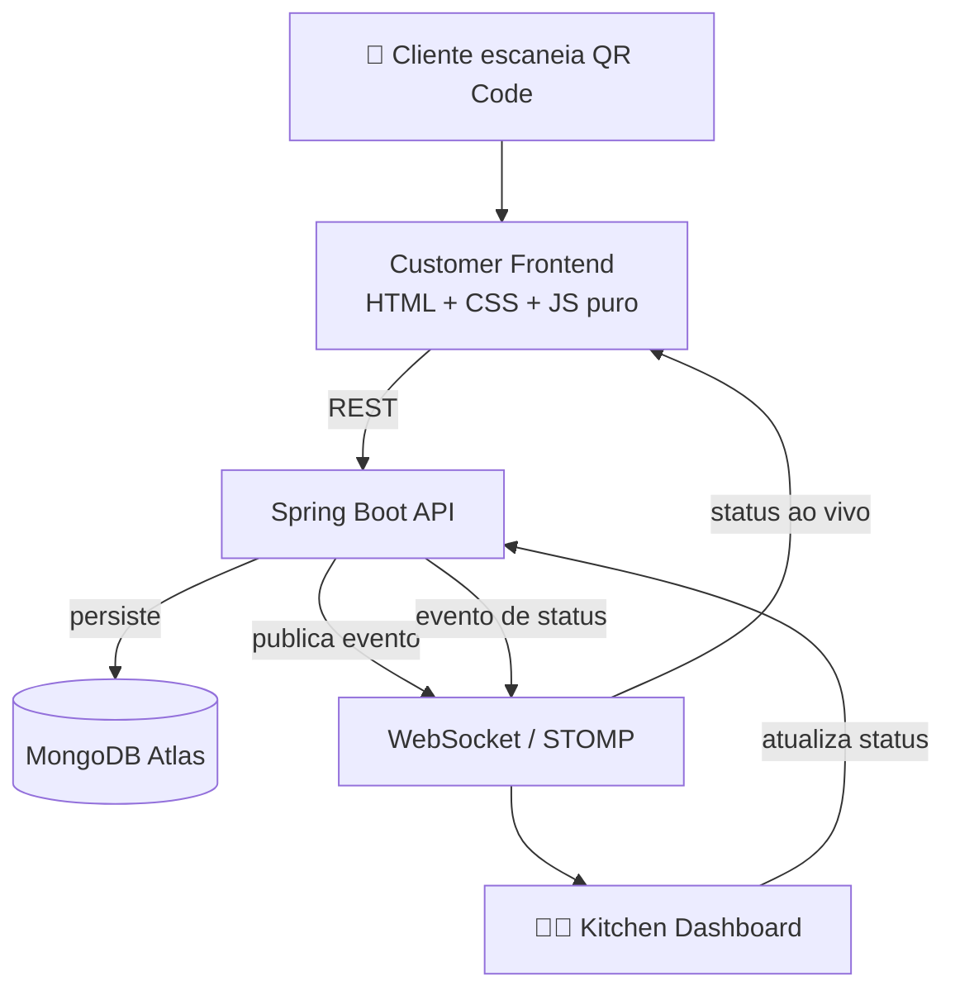
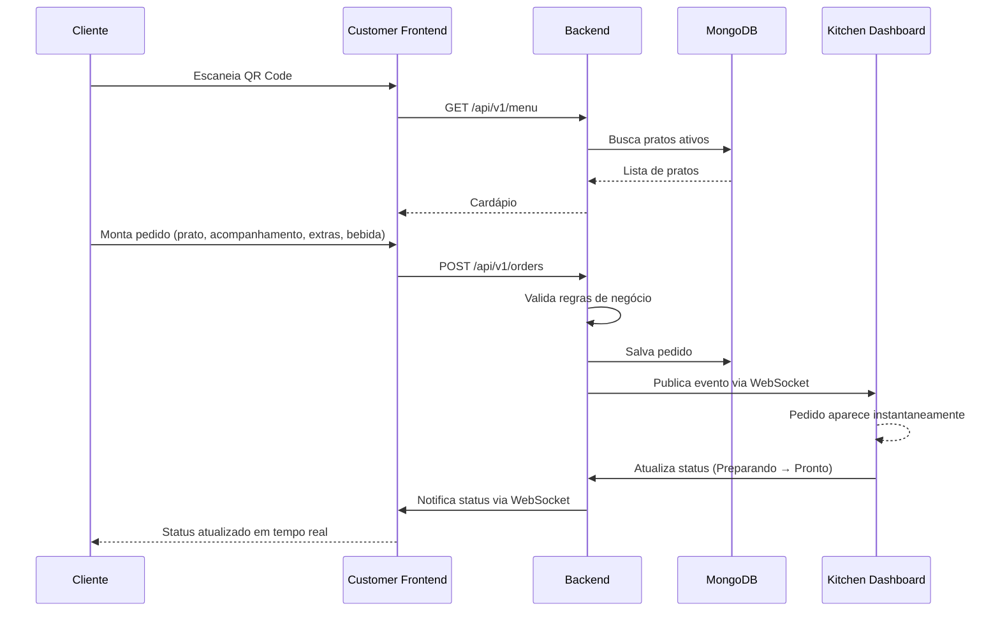

<div align="center">

# 🍽️ Pedacinho de Maria

### Sistema completo de pedidos para restaurante — Java · Spring Boot · MongoDB · WebSocket

Cardápio digital via QR Code, pedido em tempo real direto na cozinha, sem papel, sem repetir a mesma pergunta pra cada cliente.

</div>

---

## 📌 Sumário

- [Objetivo](#-objetivo)
- [Demonstração](#-demonstração)
- [Arquitetura](#-arquitetura)
- [Tecnologias](#-tecnologias)
- [Funcionalidades](#-funcionalidades)
- [Fluxo do Pedido](#-fluxo-do-pedido)
- [Estrutura do Projeto](#-estrutura-do-projeto)
- [Arquitetura de Software](#-arquitetura-de-software)
- [Banco de Dados](#-banco-de-dados)
- [WebSocket](#-websocket-tempo-real)
- [Principais Desafios](#-principais-desafios-enfrentados)
- [Como Executar Localmente](#-como-executar-localmente)
- [Variáveis de Ambiente](#-variáveis-de-ambiente)
- [Deploy](#-deploy)
- [Próximas Melhorias](#-próximas-melhorias)
- [Autor](#-autor)

---

## 🎯 Objetivo

O **Pedacinho de Maria** nasceu de um problema real e específico: um restaurante pequeno precisando explicar, todo dia, o mesmo cardápio pra cada cliente que entrava — atualizar cavalete, repetir "hoje tem isso, não tem aquilo" dezenas de vezes.

O sistema digitaliza esse fluxo por completo. O cliente escaneia um QR Code na mesa, monta o pedido sozinho — prato, acompanhamento, extras, bebida — e o pedido cai **em tempo real** no painel da cozinha, sem intermediário, sem grito de salão pra cozinha.

Três peças, sincronizadas:

| Peça | Responsabilidade |
|---|---|
| 🧑‍🍳 **Customer App** | Cardápio, montagem do pedido, acompanhamento do status |
| 👨‍🍳 **Kitchen Dashboard** | Fila de pedidos em tempo real, controle de status, timer de preparo |
| ⚙️ **Backend** | Regra de negócio, persistência, validação, tempo real |

---

## 🎥 Demonstração

| Customer App | Kitchen Dashboard |
|---|---|
|  | |

---

## 🏗️ Arquitetura



- **Customer Frontend** e **Kitchen Dashboard** são aplicações estáticas independentes, sem framework, sem build step — cada uma com seu próprio ciclo de deploy.
- **Backend** é um monólito modular em Spring Boot — decisão consciente: o volume do projeto (um restaurante, dezenas de pedidos por dia) não justifica a complexidade operacional de microsserviços.
- **MongoDB Atlas** é o único banco, em todos os ambientes — sem instância local, sem dependência de infraestrutura própria.
- **WebSocket (STOMP)** é o que torna o pedido instantâneo na cozinha, sem polling.

---

## 🛠️ Tecnologias

### Backend

| Tecnologia | Uso |
|---|---|
| Java 21 | Linguagem principal |
| Spring Boot 3 | Framework da API |
| Spring Data MongoDB | Persistência |
| Spring WebSocket + STOMP | Comunicação em tempo real |
| Spring Validation | Validação de entrada |
| MapStruct | Mapeamento Entity ↔ DTO |
| Lombok | Redução de boilerplate |
| Maven | Build e dependências |
| MongoDB Atlas | Banco de dados (cloud) |

### Frontend

| Tecnologia | Uso |
|---|---|
| HTML5 | Estrutura |
| CSS3 | Estilo, sem framework |
| JavaScript (ES6+ puro) | Toda a lógica de cliente, sem bundler |

### Infraestrutura

| Tecnologia | Uso |
|---|---|
| Render | Hospedagem do backend + frontends estáticos |
| Git / GitHub | Versionamento |

---

## ✨ Funcionalidades

### 🧑‍🍳 Customer App

- Cardápio 100% dinâmico, carregado da API — nada hardcoded
- Wizard de pedido: prato → acompanhamento (quando o prato exige) → extras → bebidas → dados do cliente
- Cálculo de total estimado em tempo real (o valor final é sempre recalculado e validado pelo backend)
- Código do pedido gerado como *capability token* (identifica o pedido sem exigir login)
- Acompanhamento de status ao vivo via WebSocket após o envio

### 👨‍🍳 Kitchen Dashboard

- Board com colunas por status (Recebido → Preparando → Pronto → Entregue)
- Recebimento de pedido novo em tempo real, sem recarregar a página
- Avanço de status por clique
- Timer de preparo controlado pelo backend (nunca pelo navegador)
- Abertura/fechamento automático de turno
- Progressão automática de pedidos esquecidos

### ⚙️ Backend

- API REST para cardápio, acompanhamentos, extras, bebidas e pedidos (leitura — ver nota abaixo sobre CRUD)
- Validação completa de regras de negócio (horário de funcionamento, disponibilidade, preço)
- Publicação de eventos em tempo real via STOMP
- Índice TTL no MongoDB para expiração automática de pedidos antigos
- Tratamento de erro centralizado, sem vazar detalhe interno ao cliente

---

## 🔄 Fluxo do Pedido



---

## 📁 Estrutura do Projeto

```text
pedacinho-de-maria/
├── pedacinho-backend/
│   ├── src/main/java/com/pedacinhodemaria/
│   │   ├── config/              # Segurança, WebSocket, Mongo, OpenAPI
│   │   ├── modules/
│   │   │   ├── menu/            # Meal, SideDish, Extra, Drink
│   │   │   └── order/           # Order, timer, WebSocket de pedido
│   │   └── shared/               # Exceções e DTOs cross-cutting
│   └── src/test/java/            # Testes unitários (JUnit 5 + Mockito)
├── customer-app/
│   ├── js/
│   │   ├── api/                  # Chamadas fetch à API
│   │   ├── modules/               # Renderização e wizard do pedido
│   │   └── utils/                 # Helpers de DOM e validação
│   └── assets/images/            # Imagens do cardápio
└── kitchen-dashboard/
    └── js/modules/                # Board, WebSocket, automações
```

---

## 🧱 Arquitetura de Software

O backend segue **Clean Architecture por módulo de domínio** (não por camada técnica global) — cada módulo (`menu`, `order`) tem suas próprias camadas:

```
Controller  →  Service / UseCase  →  Repository  →  MongoDB
                     ↓
                  Mapper (MapStruct)
                     ↓
                   DTO (resposta)
```

- **Controller**: só recebe requisição e devolve resposta — zero lógica de negócio.
- **Service / UseCase**: onde a regra de negócio vive (validação, cálculo de preço, orquestração).
- **Repository**: acesso a dado, via Spring Data (sem query manual/concatenada).
- **Mapper**: MapStruct converte entidade ↔ DTO em tempo de compilação, sem reflection em runtime.

---

## 🗄️ Banco de Dados

MongoDB Atlas, coleções principais:

| Coleção | Conteúdo |
|---|---|
| `meals` | Pratos principais (fixos + prato do dia) |
| `side_dishes` | Acompanhamentos |
| `extras` | Itens extras (sem imagem, checklist) |
| `drinks` | Bebidas |
| `orders` | Pedidos — com índice **TTL** em `createdAt`, período de retenção configurável em runtime via `collMod`, sem precisar recriar o índice |

---

## 🔌 WebSocket (Tempo Real)

**Por que WebSocket:** diferente do HTTP tradicional (onde o cliente precisa perguntar repetidamente "tem novidade?"), a conexão WebSocket fica aberta nos dois sentidos — o servidor **empurra** a informação no exato momento em que ela existe.

**Como funciona:**

- Protocolo **STOMP** sobre WebSocket — permite endereçar mensagens por tópico (`/topic/kitchen-orders`, `/topic/order-status/{orderCode}`), não só broadcast cego.
- **Kitchen Dashboard** assina `/topic/kitchen-orders` — recebe todo pedido novo e toda mudança de status, de qualquer cliente conectado.
- **Cliente** assina `/topic/order-status/{orderCode}` — o próprio `orderCode` funciona como identificador de acesso àquele canal, sem precisar de login.

---

## 🧩 Principais Desafios Enfrentados

| Desafio | Causa raiz | Solução |
|---|---|---|
| Grid de pratos "empurrado" para a direita | Grid aninhado dentro de grid — título e grade de cards viravam itens do mesmo grid pai | Cada função de renderização passou a só desenhar itens no container recebido, sem criar layout próprio (Single Responsibility) |
| `OrderMapperImpl` não compilava (`cannot find symbol: TimerCalculator`) | Import usado dentro de uma `expression = "java(...)"` do MapStruct não se propaga da interface para a classe gerada | `@Mapper(imports = TimerCalculator.class)` |
| Teste falhando de forma intermitente conforme a hora do dia | `LocalTime.now()` chamado direto no use case, acoplando o teste ao relógio real da máquina | `Clock` injetado via Spring, `Clock.fixed(...)` no teste |
| Títulos duplicados ("Extras" aparecendo duas vezes na tela) | Duas partes do código (a view e o renderer) responsáveis pelo mesmo título | Responsabilidade de título centralizada em um único lugar |
| Deploy / Render | Backend precisa escutar a porta `PORT` injetada pelo Render (não `SERVER_PORT`) | Fallback aninhado: `${PORT:${SERVER_PORT:8080}}` |

---

## 💻 Como Executar Localmente

### Backend

```bash
cd pedacinho-backend
./mvnw clean install
./mvnw spring-boot:run
```

### Frontends

```bash
cd customer-app
python3 -m http.server 5500
```

```bash
cd kitchen-dashboard
python3 -m http.server 5501
```

> Não abra os `.html` direto como arquivo local (`file://`) — os módulos ES6 exigem um servidor HTTP.

---

## 🔐 Variáveis de Ambiente

| Variável | Descrição |
|---|---|
| `MONGODB_URI` | String de conexão do MongoDB Atlas (`mongodb+srv://...`) |
| `PORT` | Porta do backend — Render injeta automaticamente |
| `CORS_ALLOWED_ORIGINS` | Origens liberadas para o Customer App e o Kitchen Dashboard |
| `SPRING_PROFILES_ACTIVE` | `dev` ou `prod` |
| `ORDER_RETENTION_DAYS` | Dias até um pedido expirar automaticamente (TTL) |

> `WHATSAPP_PHONE_NUMBER_ID` e `WHATSAPP_ACCESS_TOKEN` do briefing original só fazem sentido se a integração Cloud API existir de fato — ver seção de WhatsApp acima.

---

## 🚀 Deploy

| Componente | Onde |
|---|---|
| Backend | Render — Web Service (Docker) |
| Customer App | Render — Static Site |
| Kitchen Dashboard | Render — Static Site |
| Banco de dados | MongoDB Atlas |

---

## 🔮 Próximas Melhorias

- [ ] Login administrativo
- [ ] Notificações Push
- [ ] PWA
- [ ] Pagamento online (débito, crédito e PIX)
- [ ] Upload de imagens direto pelo painel (AWS S3)

---

## 👤 Autor

**Guilherme dos Santos**
Software Engineer — Java · Spring Boot · Software Architecture

</div>
