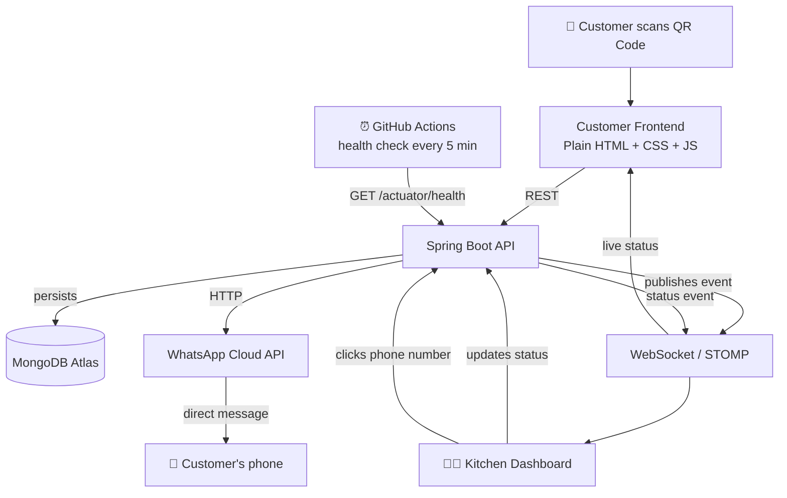
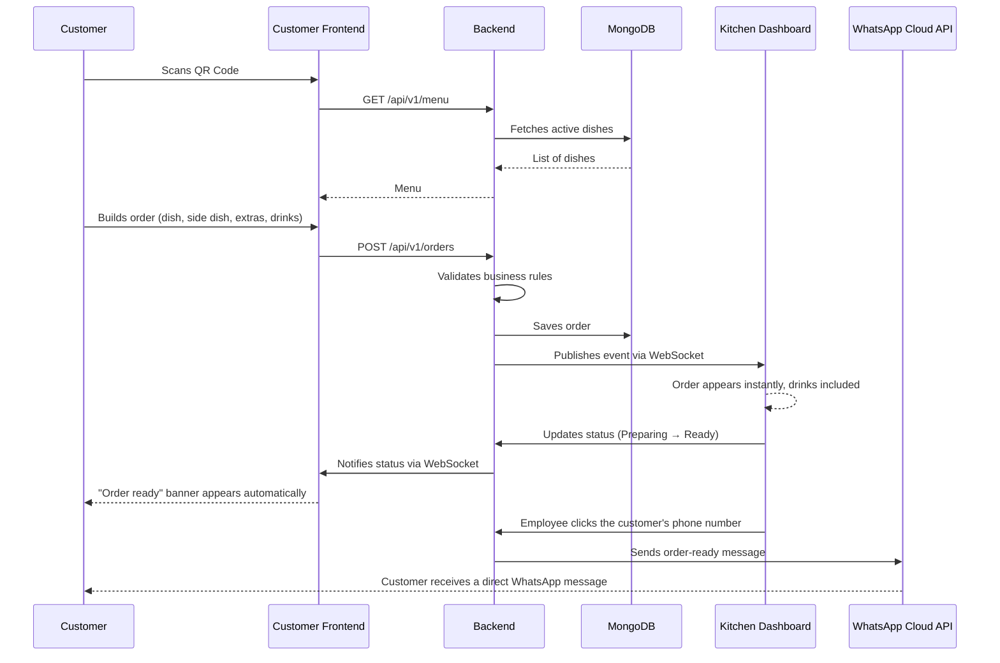

<div align="center">

# 🍽️ Pedacinho de Maria

### Complete restaurant ordering system — Java · Spring Boot · MongoDB · WebSocket

Digital menu via QR Code, real-time order straight to the kitchen — no paper, no repeating the same explanation to every customer.

</div>

---

## 📌 Table of Contents

- Goal
- Demo
- Architecture
- Technologies
- Features
- Order Flow
- Project Structure
- Software Architecture
- Database
- WebSocket
- WhatsApp Integration
- Main Challenges
- Tests
- Running Locally
- Environment Variables
- Deploy
- Changelog
- Next Improvements
- Author

---

## 🎯 Goal

**Pedacinho de Maria** was born from a real, specific problem: a small restaurant having to explain, every single day, the same menu to every customer who walked in — updating a chalkboard by the door, repeating "today we have this, we don't have that" dozens of times.

The system fully digitizes this flow. The customer scans a QR Code at the table, builds the order on their own — main dish, side dish, extras, drink — and the order lands **in real time** on the kitchen's dashboard, with no middleman, no shouting between the dining room and the kitchen.

Three synchronized pieces:

| Piece | Responsibility |
|---|---|
| 🧑‍🍳 **Customer App** | Menu, order building, status tracking |
| 👨‍🍳 **Kitchen Dashboard** | Real-time order queue, status control, prep timer |
| ⚙️ **Backend** | Business rules, persistence, validation, real time, external notification |

---

## 🎥 Demo

| Customer App | Kitchen Dashboard |
|---|---|
|  | |

---

## 🏗️ Architecture



- **Customer Frontend** and **Kitchen Dashboard** are independent static applications, no framework, no build step — each with its own deploy cycle.
- **Backend** is a modular monolith in Spring Boot — a conscious decision: the project's volume (a single restaurant, dozens of orders a day) doesn't justify the operational complexity of microservices.
- **MongoDB Atlas** is the single database, in every environment — no local instance, no dependency on self-managed infrastructure.
- **WebSocket (STOMP)** is what makes the order instantaneous in the kitchen, with no polling, and is also the channel that notifies the customer in real time when the order's status changes.
- **WhatsApp Cloud API** is an external integration triggered by the Backend — a channel complementary to WebSocket: while WebSocket updates the screen the customer already has open, WhatsApp reaches the customer even after they've closed the tab.
- **GitHub Actions** acts as a lightweight automation layer around deployment — a scheduled workflow performs a periodic health check against the backend to mitigate Render's free-tier cold start, without touching the frontend or running any business logic (see [Keep-Alive Strategy](#-keep-alive-strategy-cold-start-mitigation) under Deploy).

---

## 🛠️ Technologies

### Backend

| Technology | Use |
|---|---|
| Java 21 | Main language |
| Spring Boot 3 | API framework |
| Spring Data MongoDB | Persistence |
| Spring WebSocket + STOMP | Real-time communication |
| Spring Validation | Input validation |
| MapStruct | Entity ↔ DTO mapping |
| Lombok | Boilerplate reduction |
| Maven | Build and dependencies |
| MongoDB Atlas | Database (cloud) |
| RestTemplate | HTTP client for external integration (WhatsApp Cloud API) |

### Frontend

| Technology | Use |
|---|---|
| HTML5 | Structure |
| CSS3 | Styling, no framework |
| JavaScript (plain ES6+) | All client-side logic, no bundler |

### External integrations

| Technology | Use |
|---|---|
| WhatsApp Cloud API (Meta) | Automatic "order ready" message sent straight to the customer's phone |

### Infrastructure

| Technology | Use |
|---|---|
| Render | Hosting for the backend + static frontends |
| Git / GitHub | Version control |

---

## ✨ Features

### 🧑‍🍳 Customer App

- 100% dynamic menu, loaded from the API — nothing hardcoded
- Order wizard with a dedicated step for each choice: dish → side dish (when the dish requires one) → extras → **drinks** → customer details. Extras and Drinks no longer share the same screen — each has its own loading, its own rendering, and its own partial total, which makes the flow more predictable both for the user and for whoever maintains the code
- Real-time estimated total (the final value is always recalculated and validated by the backend)
- Order code generated as a *capability token* (identifies the order without requiring login)
- Live status tracking via WebSocket after submission, including a confirmation banner that appears automatically when the order is ready

### 👨‍🍳 Kitchen Dashboard

- Board with columns per status (Received → Preparing → Ready → Delivered)
- New orders received in real time, no page reload
- Order ticket now also showing the list of **drinks** chosen (with a "No drinks" fallback when there are none) — before, only the dish, side dish, and extras appeared
- Status advanced with a click
- Customer's phone number shown directly on the ticket, with a button to **trigger the WhatsApp "order ready" message** without leaving the Dashboard
- Prep timer controlled by the backend (never by the browser)
- Automatic shift opening/closing
- Automatic progression for forgotten orders

### ⚙️ Backend

- REST API for menu, side dishes, extras, drinks, and orders (read — see the note below about CRUD)
- Full business rule validation (opening hours, availability, price)
- Real-time event publishing via STOMP
- TTL index in MongoDB for automatic expiration of old orders
- Centralized error handling, with no internal detail leaked to the client
- Automatic message sending via **WhatsApp Cloud API** when triggered by the kitchen, isolated behind a port/adapter (see [WhatsApp Integration](#-whatsapp-integration))

---

## 🔄 Order Flow



Two notifications, independent by design and on purpose: the **WebSocket**
update covers the customer who still has the order tab open; the
**WhatsApp** trigger covers the customer who has already closed the tab,
or who just wants the heads-up straight on their phone. Neither replaces
the other — and neither depends on the kitchen remembering to do both
manually: the WebSocket status update is automatic from the moment the
order is created; the WhatsApp trigger is an explicit one-click action on
the ticket, no form, no typing a phone number.

---

## 📁 Project Structure

```text
pedacinho-de-maria/
├── pedacinho-backend/
│   ├── src/main/java/com/pedacinhodemaria/
│   │   ├── config/               # Security, WebSocket, Mongo, OpenAPI, RestTemplate
│   │   ├── modules/
│   │   │   ├── menu/             # Meal, SideDish, Extra, Drink
│   │   │   └── order/            # Order, timer, order WebSocket,
│   │   │                         # WhatsApp notification port (service/)
│   │   ├── infrastructure/
│   │   │   └── whatsapp/         # Concrete adapter for the WhatsApp provider
│   │   └── shared/                # Cross-cutting exceptions and DTOs
│   └── src/test/java/             # Unit tests (JUnit 5 + Mockito)
├── customer-app/
│   ├── js/
│   │   ├── api/                   # Fetch calls to the API
│   │   ├── modules/                # Rendering and order wizard (includes the Drinks step)
│   │   └── utils/                  # DOM and validation helpers
│   └── assets/images/             # Menu images
└── kitchen-dashboard/
    └── js/modules/                 # Board, WebSocket, automations, WhatsApp trigger
```

---

## 🧱 Software Architecture

The backend follows **Clean Architecture per domain module** (not by global technical layer) — each module (`menu`, `order`) has its own layers:

```
Controller  →  Service / UseCase  →  Repository  →  MongoDB
                     ↓
                  Mapper (MapStruct)
                     ↓
                   DTO (response)
```

- **Controller**: only receives the request and returns the response — zero business logic.
- **Service / UseCase**: where the business rule lives (validation, price calculation, orchestration).
- **Repository**: data access, via Spring Data (no manual/concatenated query).
- **Mapper**: MapStruct converts entity ↔ DTO at compile time, no reflection at runtime.

This exact same design repeats, without exception, for any integration
with an external system — that's the case with the WhatsApp notification:

```
Controller  →  Use Case  →  Port (interface)  →  Adapter  →  External provider
```

The **Use Case** only depends on the **Port** (an interface), never on
the concrete provider. This keeps the business rule ("let the customer
know the order is ready") completely isolated from *how* that notice is
delivered — a detail that lives only in the **Adapter**. See
[WhatsApp Integration](#-whatsapp-integration) for the full mapping of
these classes.

A concrete business rule worth highlighting, in the `order` module's
Use Case layer: when an order is created, the price of the dish, the
side dish, and each chosen extra/drink is **frozen as a snapshot**,
directly inside the order document itself. If an item's price changes
later in the menu, orders already placed are not retroactively affected
— the order keeps the price that was valid at the moment it was placed.

---

## 🗄️ Database

MongoDB Atlas, main collections:

| Collection | Content |
|---|---|
| `meals` | Main dishes (fixed + dish of the day) |
| `side_dishes` | Side dishes |
| `extras` | Extra items (no image, checklist) |
| `drinks` | Drinks |
| `orders` | Orders — with a **TTL** index on `createdAt`, retention period configurable at runtime via `collMod`, no need to recreate the index |

---

## 🔌 WebSocket (Real Time)

**Why WebSocket:** unlike traditional HTTP (where the client has to keep asking "anything new?"), the WebSocket connection stays open in both directions — the server **pushes** the information the exact moment it exists.

**How it works:**

- **STOMP** protocol over WebSocket — allows addressing messages by topic (`/topic/kitchen-orders`, `/topic/order-status/{orderCode}`), not just a blind broadcast.
- **Kitchen Dashboard** subscribes to `/topic/kitchen-orders` — receives every new order and every status change, from any connected client.
- **Customer** subscribes to `/topic/order-status/{orderCode}` — the `orderCode` itself works as the access identifier for that channel, with no need for login.

**Automatic "order ready" notice:** when the kitchen changes an order's
status to `READY`, the backend publishes that event on the same topic as
always — no new topic was created. The Customer Frontend, already
subscribed since the moment the order was created, receives that event
and automatically reveals an "order ready" banner right on the tracking
screen — no polling, no refresh, reusing 100% of the WebSocket
infrastructure that already existed for any other status change.

---

## 📲 WhatsApp Integration

Besides the in-app real-time update, the system also notifies the
customer **directly on WhatsApp** when the order is ready — a manual
trigger, done by the kitchen with a single click on the customer's phone
number, right on the Kitchen Dashboard's ticket.

### Why Port/Adapter

This integration follows the same dependency inversion principle already
used across the rest of the project (see
[Software Architecture](#-software-architecture)): the Use Case that
decides **when** to notify the customer doesn't know, and doesn't need to
know, **how** that message is delivered. This is what separates business
rule from infrastructure detail — and it's what makes it trivial, in the
future, to switch providers: if the project migrates from the WhatsApp
Cloud API (Meta) to Twilio, Evolution API, Z-API, or any other, the change
stays entirely contained in a new Adapter class. No Use Case, no
Controller, no business rule needs to be touched.

### Components

| Component | Layer | Responsibility |
|---|---|---|
| `WhatsAppMessageSender` | Port (interface) | Single contract: `sendMessage(phoneNumber, message)` — doesn't know the provider behind it |
| `SendOrderReadyWhatsAppMessageUseCase` | Use Case | Looks up the order by `orderCode`, validates that a phone number exists, builds the fixed "order ready" message, and delegates sending to the Port |
| `WhatsAppCloudApiMessageSender` | Adapter | Concrete implementation of the Port using the WhatsApp Cloud API (Meta), via plain `RestTemplate` — no third-party SDK |
| `PhoneNumberNotAvailableException` | Domain exception | Thrown when the Use Case tries to notify an order with no phone number on file (e.g., a `DINE_IN` order, where a phone number is never required) |
| `RestTemplateConfig` | Config | Exposes the `RestTemplate` bean used by the Adapter |
| `OrderController` (new endpoint) | Controller | `POST /api/v1/orders/{orderCode}/whatsapp-ready-message` — triggers the Use Case from the Dashboard click |

### Trigger flow

```
Employee clicks the phone number (Kitchen Dashboard)
        ↓
POST /orders/{orderCode}/whatsapp-ready-message
        ↓
OrderController
        ↓
SendOrderReadyWhatsAppMessageUseCase
        ↓
WhatsAppMessageSender (Port)
        ↓
WhatsAppCloudApiMessageSender (Adapter)
        ↓
WhatsApp Cloud API (Meta)
        ↓
Customer's phone receives the message
```

A network failure talking to the Cloud API is logged by the Adapter, but
not propagated as an error to whoever clicked on the Dashboard — the
employee already saw the action trigger; a momentary hiccup from the
external provider shouldn't block the kitchen's workflow.

---

## 🧩 Main Challenges Faced

| Challenge | Root Cause | Solution |
|---|---|---|
| Dish grid "pushed" to the right | Grid nested inside a grid — the mounting container (`#menu-list`) already had the layout class in the HTML, and `menuRenderer.js` itself created another grid inside it; the inner grid ended up squeezed into a single column of the outer one | Mounting containers (`#menu-list`, `#side-dish-list`, `#extras-list`) became neutral in the HTML — the whole structure (`.menu-section` → grid → cards) is now built from a single source of truth, the renderer itself; `repeat(2, minmax(0, 1fr))` and `min-width: 0` also eliminate "grid blowout" (a grid track growing beyond its 1fr because of the card's content) |
| `OrderMapperImpl` wouldn't compile (`cannot find symbol: TimerCalculator`) | An import used inside a MapStruct `expression = "java(...)"` doesn't propagate from the interface to the generated class | `@Mapper(imports = TimerCalculator.class)` |
| A test failing intermittently depending on the time of day | `LocalTime.now()` called directly in the use case, coupling the test to the machine's real clock | `Clock` injected via Spring, `Clock.fixed(...)` in the test |
| Duplicated titles ("Extras" appearing twice on screen) | Two parts of the code (the view and the renderer) both responsible for the same title | Title responsibility centralized in a single place |
| Deploy / Render | The backend needs to listen on the `PORT` injected by Render (not `SERVER_PORT`) | Nested fallback: `${PORT:${SERVER_PORT:8080}}` |
| Drinks selected by the customer weren't showing up on the Kitchen Dashboard | The Dashboard's renderer never actually drew a drinks section on the ticket — the data already arrived correctly all the way to the API response layer, only the display was missing | `orderRenderer.js` now draws the "Drinks" section (with a "No drinks" fallback), following the same pattern already used for Extras |
| Changing a `@RequiredArgsConstructor` constructor's signature silently breaks any manual instantiation | `OrderControllerTest` manually instantiated `OrderController` (standalone MockMvc); adding the new Use Case to the controller changed the arity of the Lombok-generated constructor, and the test stopped compiling | A new `@Mock` was added to the test and the instantiation updated to the 4 arguments — a good reminder that tests using `standaloneSetup` need to evolve alongside the controller's signature |
| Backend going idle on Render's Free tier after periods without traffic, making the first request after that window noticeably slow | Render's Free tier suspends idle instances; the first request has to wait for the container to spin back up — expected infrastructure behavior tied to the plan's lifecycle, not an application defect | Scheduled GitHub Actions workflow (`keep-render-awake.yml`, every 5 minutes + manual `workflow_dispatch`) pinging `/actuator/health`, hardened with a retry policy (`--retry 5 --retry-delay 15 --retry-all-errors --max-time 120`) to absorb the brief `503` window while the instance wakes up — see [Keep-Alive Strategy](#-keep-alive-strategy-cold-start-mitigation) |

---

## ✅ Tests

Unit test suite with **JUnit 5 + Mockito**, using **MockMvc in standalone
mode** for the Controller tests — no full Spring context boot, just the
controller under test mounted with the necessary mocks. Faster, more
isolated, and doesn't depend on security/infrastructure configuration to
validate the HTTP contract.

`OrderControllerTest` covers:

- Order creation: `201` with the correct body on a valid request; `400`
  when the customer name is blank (actually exercising `@Valid` through
  MockMvc, unlike the `CreateOrderUseCase` tests, which call the use case
  directly and never go through Spring MVC's Bean Validation layer);
  `400` when a `TAKEAWAY` order is missing a phone number.
- Order lookup: `200` with the order when the `orderCode` exists; `404`
  when it doesn't.
- **WhatsApp message trigger** (added along with the integration): `204
  No Content` on a successful trigger, verifying that
  `SendOrderReadyWhatsAppMessageUseCase.execute(orderCode)` was indeed
  called; `404` when the `orderCode` doesn't exist, reusing the same
  `OrderNotFoundException` already handled by the `GlobalExceptionHandler`
  for the other endpoints.

`GlobalExceptionHandler` is registered manually in `standaloneSetup` —
without it, MockMvc would return Spring's generic `500` instead of the
structured `ApiError` the API actually returns in production.

---

## 💻 Running Locally

### Backend

```bash
cd pedacinho-backend
./mvnw clean install
./mvnw spring-boot:run
```

### Frontends

```bash
cd customer-app
python3 -m http.server 5500
```

```bash
cd kitchen-dashboard
python3 -m http.server 5501
```

> Don't open the `.html` files directly as local files (`file://`) — ES6 modules require an HTTP server.

---

## 🔐 Environment Variables

| Variable | Description |
|---|---|
| `MONGODB_URI` | MongoDB Atlas connection string (`mongodb+srv://...`) |
| `PORT` | Backend port — Render injects it automatically |
| `CORS_ALLOWED_ORIGINS` | Origins allowed for the Customer App and the Kitchen Dashboard |
| `SPRING_PROFILES_ACTIVE` | `dev` or `prod` |
| `ORDER_RETENTION_DAYS` | Days until an order automatically expires (TTL) |
| `WHATSAPP_PHONE_NUMBER_ID` | WhatsApp Business Phone Number ID, obtained from Meta for Developers |
| `WHATSAPP_ACCESS_TOKEN` | Access token (permanent, in production) for the WhatsApp Cloud API App |

---

## 🚀 Deploy

| Component | Where |
|---|---|
| Backend | Render — Web Service (Docker) |
| Customer App | Render — Static Site |
| Kitchen Dashboard | Render — Static Site |
| Database | MongoDB Atlas |
| WhatsApp notification | WhatsApp Cloud API (Meta) — external integration, no self-hosted infrastructure |

### 🩺 Keep-Alive Strategy (Cold Start Mitigation)

On Render's Free tier, the backend Web Service can go idle after a period without incoming requests. When a customer opened the menu after that idle window, the first request had to wait for the instance to spin back up — a real, observed characteristic of the hosting plan's lifecycle, not an application bug.

To reduce how often a customer actually runs into that cold start, a scheduled GitHub Actions workflow (`.github/workflows/keep-render-awake.yml`) pings the backend on a fixed interval:

```yaml
on:
  schedule:
    - cron: "*/5 * * * *"
  workflow_dispatch:
```

Roughly every 5 minutes, GitHub Actions sends a request to:

```
GET https://pedacinho-de-maria.onrender.com/actuator/health
```

**Why `/actuator/health` specifically:** it's the lightest endpoint that still exercises the running Spring Boot application. The workflow never touches the frontend and never runs any business logic — its only job is confirming the backend process is alive and responsive, which is exactly the level of observability this problem needed, nothing more.

**Handling the cold-start window itself:** during implementation, the first request against a cold instance could return `HTTP 503 Service Unavailable` while Render was still bringing the container back up. To absorb that window instead of just failing once, the workflow was hardened with a retry policy:

```bash
curl --retry 5 --retry-delay 15 --retry-all-errors --max-time 120 \
  https://pedacinho-de-maria.onrender.com/actuator/health
```

| Flag | Role |
|---|---|
| `--retry 5` | Retries the request up to 5 times if it fails |
| `--retry-delay 15` | Waits 15 seconds between attempts, giving the instance time to finish waking up |
| `--retry-all-errors` | Also retries on error types `curl` wouldn't retry by default — including a `503` from a still-starting instance |
| `--max-time 120` | Caps how long a single request attempt can run, so a stuck attempt doesn't hang the workflow indefinitely |

**Benefit and limitation:** this reduces the odds of a customer being the one to hit a fully idle backend after a quiet period — it's a cold-start **mitigation**, not a guarantee that the service stays permanently warm. If the workflow doesn't run for any reason (GitHub Actions outage, a disabled workflow), the backend keeps working exactly as before; it just goes back to depending on Render's own cold-start behavior.

---

---

## 🗂️ Changelog

### v1.1.0

- **Drinks with their own step in the Wizard** — used to share a screen
  with Extras; now they have their own loading, rendering, and partial
  total.
- **Drinks shown on the Kitchen Dashboard** — ticket gained a dedicated
  section, with a "No drinks" fallback.
- **Root-cause fix for the dish grid** — eliminated a grid nested inside
  a grid; visual standardization between Dishes, Side Dishes, and Drinks
  using `.menu-section` as a single wrapper.
- **Automatic "order ready" notice via WebSocket** — banner shown
  automatically on the Customer Frontend when the status changes to
  `READY`, reusing the topic subscription that already existed.
- **WhatsApp Cloud API integration** — new Controller → Use Case → Port →
  Adapter flow for manually triggering an "order ready" message straight
  to the customer's phone, from a click on the Dashboard.
- **Expanded test coverage** — `OrderControllerTest` updated for
  `OrderController`'s new signature, with new cases for the WhatsApp
  endpoint.

### v1.0.0

- Initial version: digital menu via QR Code, order wizard, Kitchen
  Dashboard with a status-based board, real-time communication via
  WebSocket/STOMP, persistence in MongoDB Atlas, deploy on Render.

---

## 🔮 Next Improvements

- [ ] Admin login
- [ ] Push notifications
- [ ] PWA
- [ ] Online payment (debit, credit, and PIX)
- [ ] Direct image upload from the dashboard (AWS S3)
- [ ] Support for alternative WhatsApp providers (Twilio, Evolution API), validating the Adapter swap without touching business rules
- [ ] WhatsApp message via a pre-approved template, to cover sending outside the Cloud API's 24-hour free-conversation window

---

## 👤 Author

**Guilherme dos Santos**
Software Engineer — Java · Spring Boot · Software Architecture

</div>
