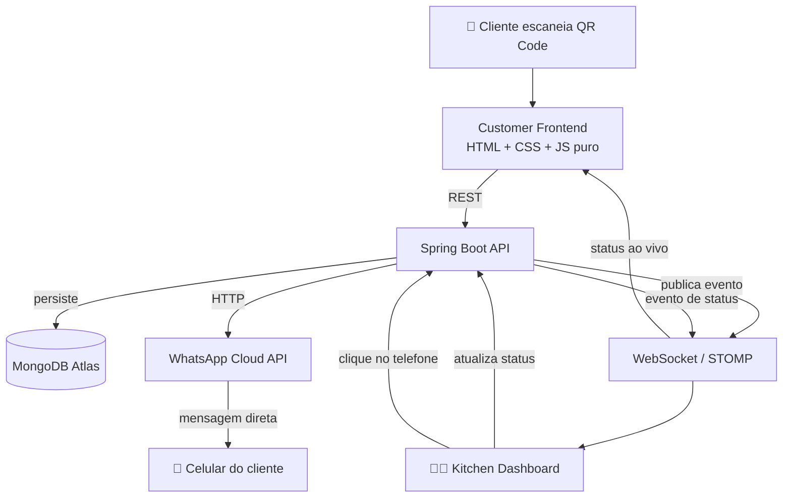
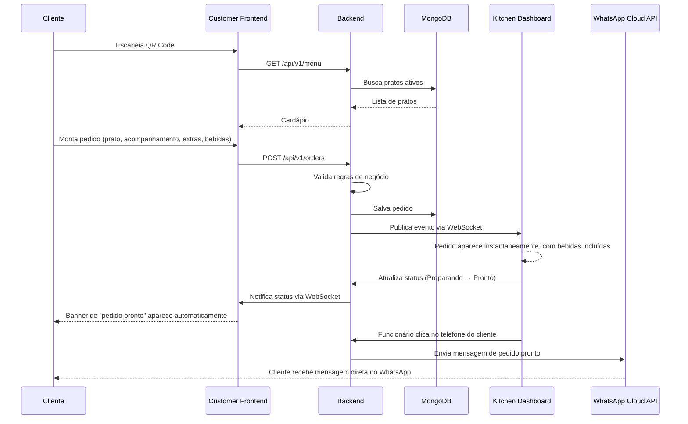

<div align="center">

# 🍽️ Pedacinho de Maria

### Sistema completo de pedidos para restaurante — Java · Spring Boot · MongoDB · WebSocket

Cardápio digital via QR Code, pedido em tempo real direto na cozinha, sem papel, sem repetir a mesma pergunta pra cada cliente.

</div>

---

## 📌 Sumário

- Objetivo
- Demonstração
- Arquitetura
- Tecnologias
- Funcionalidades
- Fluxo do Pedido
- Estrutura do Projeto
- Arquitetura de Software
- Banco de Dados
- WebSocket
- Integração com WhatsApp
- Principais Desafios
- Testes
- Como Executar Localmente
- Variáveis de Ambiente
- Deploy
- Changelog
- Próximas Melhorias
- Autor

---

## 🎯 Objetivo

O **Pedacinho de Maria** nasceu de um problema real e específico: um restaurante pequeno precisando explicar, todo dia, o mesmo cardápio pra cada cliente que entrava — atualizar cavalete, repetir "hoje tem isso, não tem aquilo" dezenas de vezes.

O sistema digitaliza esse fluxo por completo. O cliente escaneia um QR Code na mesa, monta o pedido sozinho — prato, acompanhamento, extras, bebida — e o pedido cai **em tempo real** no painel da cozinha, sem intermediário, sem grito de salão pra cozinha.

Três peças, sincronizadas:

| Peça | Responsabilidade |
|---|---|
| 🧑‍🍳 **Customer App** | Cardápio, montagem do pedido, acompanhamento do status |
| 👨‍🍳 **Kitchen Dashboard** | Fila de pedidos em tempo real, controle de status, timer de preparo |
| ⚙️ **Backend** | Regra de negócio, persistência, validação, tempo real, notificação externa |

---

## 🎥 Demonstração

| Customer App | Kitchen Dashboard |
|---|---|
|  | |

---

## 🏗️ Arquitetura



- **Customer Frontend** e **Kitchen Dashboard** são aplicações estáticas independentes, sem framework, sem build step — cada uma com seu próprio ciclo de deploy.
- **Backend** é um monólito modular em Spring Boot — decisão consciente: o volume do projeto (um restaurante, dezenas de pedidos por dia) não justifica a complexidade operacional de microsserviços.
- **MongoDB Atlas** é o único banco, em todos os ambientes — sem instância local, sem dependência de infraestrutura própria.
- **WebSocket (STOMP)** é o que torna o pedido instantâneo na cozinha, sem polling, e também é o canal que avisa o cliente em tempo real quando o pedido muda de status.
- **WhatsApp Cloud API** é uma integração externa disparada pelo Backend — canal complementar ao WebSocket: enquanto o WebSocket atualiza a tela que o cliente já está olhando, o WhatsApp alcança o cliente mesmo que ele tenha fechado a aba.

---

## 🛠️ Tecnologias

### Backend

| Tecnologia | Uso |
|---|---|
| Java 21 | Linguagem principal |
| Spring Boot 3 | Framework da API |
| Spring Data MongoDB | Persistência |
| Spring WebSocket + STOMP | Comunicação em tempo real |
| Spring Validation | Validação de entrada |
| MapStruct | Mapeamento Entity ↔ DTO |
| Lombok | Redução de boilerplate |
| Maven | Build e dependências |
| MongoDB Atlas | Banco de dados (cloud) |
| RestTemplate | Cliente HTTP para integração externa (WhatsApp Cloud API) |

### Frontend

| Tecnologia | Uso |
|---|---|
| HTML5 | Estrutura |
| CSS3 | Estilo, sem framework |
| JavaScript (ES6+ puro) | Toda a lógica de cliente, sem bundler |

### Integrações externas

| Tecnologia | Uso |
|---|---|
| WhatsApp Cloud API (Meta) | Envio de mensagem automática de "pedido pronto" direto no celular do cliente |

### Infraestrutura

| Tecnologia | Uso |
|---|---|
| Render | Hospedagem do backend + frontends estáticos |
| Git / GitHub | Versionamento |

---

## ✨ Funcionalidades

### 🧑‍🍳 Customer App

- Cardápio 100% dinâmico, carregado da API — nada hardcoded
- Wizard de pedido com etapa exclusiva para cada tipo de escolha: prato → acompanhamento (quando o prato exige) → extras → **bebidas** → dados do cliente. Extras e Bebidas deixaram de dividir a mesma tela — cada uma tem seu próprio carregamento, sua própria renderização e seu próprio total parcial, o que deixa o fluxo mais previsível tanto para o usuário quanto para quem mantém o código
- Cálculo de total estimado em tempo real (o valor final é sempre recalculado e validado pelo backend)
- Código do pedido gerado como *capability token* (identifica o pedido sem exigir login)
- Acompanhamento de status ao vivo via WebSocket após o envio, incluindo um banner de confirmação que aparece automaticamente quando o pedido fica pronto

### 👨‍🍳 Kitchen Dashboard

- Board com colunas por status (Recebido → Preparando → Pronto → Entregue)
- Recebimento de pedido novo em tempo real, sem recarregar a página
- Ticket do pedido mostrando também a lista de **bebidas** escolhidas (com fallback "Nenhuma bebida" quando não há nenhuma) — antes só prato, acompanhamento e extras apareciam
- Avanço de status por clique
- Telefone do cliente exibido diretamente no ticket, com botão para **disparar a mensagem de WhatsApp de pedido pronto** sem sair do Dashboard
- Timer de preparo controlado pelo backend (nunca pelo navegador)
- Abertura/fechamento automático de turno
- Progressão automática de pedidos esquecidos

### ⚙️ Backend

- API REST para cardápio, acompanhamentos, extras, bebidas e pedidos (leitura — ver nota abaixo sobre CRUD)
- Validação completa de regras de negócio (horário de funcionamento, disponibilidade, preço)
- Publicação de eventos em tempo real via STOMP
- Índice TTL no MongoDB para expiração automática de pedidos antigos
- Tratamento de erro centralizado, sem vazar detalhe interno ao cliente
- Envio automático de mensagem via **WhatsApp Cloud API** quando solicitado pela cozinha, isolado atrás de uma porta/adapter (ver [Integração com WhatsApp](#-integração-com-whatsapp))

---

## 🔄 Fluxo do Pedido



Duas notificações independentes, e propositalmente independentes: a
atualização via **WebSocket** cobre o cliente que ainda está com a aba do
pedido aberta; o disparo via **WhatsApp** cobre o cliente que já fechou a
aba, ou que só quer receber o aviso direto no celular. Uma não substitui a
outra — e nenhuma das duas depende de a cozinha lembrar de fazer as duas
coisas manualmente: a atualização de status via WebSocket é automática
desde a criação do pedido; o disparo de WhatsApp é uma ação explícita de
um clique no ticket, sem formulário, sem digitar número.

---

## 📁 Estrutura do Projeto

```text
pedacinho-de-maria/
├── pedacinho-backend/
│   ├── src/main/java/com/pedacinhodemaria/
│   │   ├── config/               # Segurança, WebSocket, Mongo, OpenAPI, RestTemplate
│   │   ├── modules/
│   │   │   ├── menu/             # Meal, SideDish, Extra, Drink
│   │   │   └── order/            # Order, timer, WebSocket de pedido,
│   │   │                         # porta de notificação por WhatsApp (service/)
│   │   ├── infrastructure/
│   │   │   └── whatsapp/         # Adapter concreto do provedor de WhatsApp
│   │   └── shared/                # Exceções e DTOs cross-cutting
│   └── src/test/java/             # Testes unitários (JUnit 5 + Mockito)
├── customer-app/
│   ├── js/
│   │   ├── api/                   # Chamadas fetch à API
│   │   ├── modules/                # Renderização e wizard do pedido (inclui etapa de Bebidas)
│   │   └── utils/                  # Helpers de DOM e validação
│   └── assets/images/             # Imagens do cardápio
└── kitchen-dashboard/
    └── js/modules/                 # Board, WebSocket, automações, disparo de WhatsApp
```

---

## 🧱 Arquitetura de Software

O backend segue **Clean Architecture por módulo de domínio** (não por camada técnica global) — cada módulo (`menu`, `order`) tem suas próprias camadas:

```
Controller  →  Service / UseCase  →  Repository  →  MongoDB
                     ↓
                  Mapper (MapStruct)
                     ↓
                   DTO (resposta)
```

- **Controller**: só recebe requisição e devolve resposta — zero lógica de negócio.
- **Service / UseCase**: onde a regra de negócio vive (validação, cálculo de preço, orquestração).
- **Repository**: acesso a dado, via Spring Data (sem query manual/concatenada).
- **Mapper**: MapStruct converte entidade ↔ DTO em tempo de compilação, sem reflection em runtime.

Esse mesmo desenho se repete, sem exceção, para qualquer integração com um
sistema externo — é o caso da notificação por WhatsApp:

```
Controller  →  Use Case  →  Port (interface)  →  Adapter  →  Provedor externo
```

O **Use Case** depende só da **Port** (uma interface), nunca do provedor
concreto. Isso mantém a regra de negócio ("avisar o cliente que o pedido
está pronto") completamente isolada de *como* esse aviso é entregue —
detalhe que vive só no **Adapter**. Ver [Integração com WhatsApp](#-integração-com-whatsapp)
para o mapeamento completo dessas classes.

Um exemplo concreto de regra de negócio que vale destacar, na camada de
Use Case do módulo `order`: quando um pedido é criado, o preço do prato,
do acompanhamento e de cada extra/bebida escolhido são **congelados em
snapshot**, direto dentro do próprio documento do pedido. Se o preço de
um item mudar depois no cardápio, pedidos já feitos não são afetados
retroativamente — o pedido continua valendo o preço que valia no momento
em que foi feito.

---

## 🗄️ Banco de Dados

MongoDB Atlas, coleções principais:

| Coleção | Conteúdo |
|---|---|
| `meals` | Pratos principais (fixos + prato do dia) |
| `side_dishes` | Acompanhamentos |
| `extras` | Itens extras (sem imagem, checklist) |
| `drinks` | Bebidas |
| `orders` | Pedidos — com índice **TTL** em `createdAt`, período de retenção configurável em runtime via `collMod`, sem precisar recriar o índice |

---

## 🔌 WebSocket (Tempo Real)

**Por que WebSocket:** diferente do HTTP tradicional (onde o cliente precisa perguntar repetidamente "tem novidade?"), a conexão WebSocket fica aberta nos dois sentidos — o servidor **empurra** a informação no exato momento em que ela existe.

**Como funciona:**

- Protocolo **STOMP** sobre WebSocket — permite endereçar mensagens por tópico (`/topic/kitchen-orders`, `/topic/order-status/{orderCode}`), não só broadcast cego.
- **Kitchen Dashboard** assina `/topic/kitchen-orders` — recebe todo pedido novo e toda mudança de status, de qualquer cliente conectado.
- **Cliente** assina `/topic/order-status/{orderCode}` — o próprio `orderCode` funciona como identificador de acesso àquele canal, sem precisar de login.

**Aviso automático de pedido pronto:** quando a cozinha muda o status de
um pedido para `READY`, o backend publica esse evento no mesmo tópico de
sempre — nenhum tópico novo foi criado. O Customer Frontend, que já
estava assinado desde o momento em que o pedido foi criado, recebe esse
evento e revela automaticamente um banner de "pedido pronto" na própria
tela de acompanhamento — sem polling, sem refresh, reaproveitando 100%
da infraestrutura de WebSocket que já existia para qualquer outra
mudança de status.

---

## 📲 Integração com WhatsApp

Além da atualização em tempo real dentro do app, o sistema também avisa o
cliente **diretamente no WhatsApp** quando o pedido fica pronto — disparo
manual, feito pela cozinha com um clique no telefone do cliente, direto
no ticket do Kitchen Dashboard.

### Por que Porta/Adapter

Essa integração segue o mesmo princípio de inversão de dependência já
usado no resto do projeto (ver [Arquitetura de Software](#-arquitetura-de-software)):
o Use Case que decide **quando** avisar o cliente não sabe, e não precisa
saber, **como** essa mensagem é entregue. Isso é o que separa regra de
negócio de detalhe de infraestrutura — e é o que torna trivial, no
futuro, trocar de provedor: se o projeto migrar da WhatsApp Cloud API
(Meta) para Twilio, Evolution API, Z-API ou qualquer outro, a mudança
fica inteiramente contida numa nova classe de Adapter. Nenhum Use Case,
nenhum Controller, nenhuma regra de negócio precisa ser tocada.

### Componentes

| Componente | Camada | Responsabilidade |
|---|---|---|
| `WhatsAppMessageSender` | Port (interface) | Contrato único: `sendMessage(phoneNumber, message)` — não conhece o provedor por trás |
| `SendOrderReadyWhatsAppMessageUseCase` | Use Case | Busca o pedido pelo `orderCode`, valida se há telefone cadastrado, monta a mensagem fixa de "pedido pronto" e delega o envio à Port |
| `WhatsAppCloudApiMessageSender` | Adapter | Implementação concreta da Port usando a WhatsApp Cloud API (Meta), via `RestTemplate` puro — sem SDK de terceiros |
| `PhoneNumberNotAvailableException` | Exceção de domínio | Lançada quando o Use Case tenta notificar um pedido sem telefone cadastrado (ex.: pedido `DINE_IN`, onde telefone nunca é obrigatório) |
| `RestTemplateConfig` | Config | Expõe o bean de `RestTemplate` usado pelo Adapter |
| `OrderController` (endpoint novo) | Controller | `POST /api/v1/orders/{orderCode}/whatsapp-ready-message` — dispara o Use Case a partir do clique no Dashboard |

### Fluxo do disparo

```
Funcionário clica no telefone (Kitchen Dashboard)
        ↓
POST /orders/{orderCode}/whatsapp-ready-message
        ↓
OrderController
        ↓
SendOrderReadyWhatsAppMessageUseCase
        ↓
WhatsAppMessageSender (Port)
        ↓
WhatsAppCloudApiMessageSender (Adapter)
        ↓
WhatsApp Cloud API (Meta)
        ↓
Celular do cliente recebe a mensagem
```

Uma falha de rede ao falar com a Cloud API é logada pelo Adapter, mas não
propagada como erro para quem clicou no Dashboard — o funcionário já viu
a ação disparada; uma instabilidade momentânea do provedor externo não
deveria travar o fluxo de trabalho da cozinha.

---

## 🧩 Principais Desafios Enfrentados

| Desafio | Causa raiz | Solução |
|---|---|---|
| Grid de pratos "empurrado" para a direita | Grid aninhado dentro de grid — o container de montagem (`#menu-list`) já vinha com a classe de layout no HTML, e o próprio `menuRenderer.js` criava outro grid por dentro; o grid interno ficava espremido em uma única coluna do externo | Containers de montagem (`#menu-list`, `#side-dish-list`, `#extras-list`) passaram a ser neutros no HTML — toda a estrutura (`.menu-section` → grid → cards) é montada por uma única fonte de verdade, o próprio renderer; `repeat(2, minmax(0, 1fr))` e `min-width: 0` eliminam também o "grid blowout" (track de grid crescendo além do 1fr por causa do conteúdo do card) |
| `OrderMapperImpl` não compilava (`cannot find symbol: TimerCalculator`) | Import usado dentro de uma `expression = "java(...)"` do MapStruct não se propaga da interface para a classe gerada | `@Mapper(imports = TimerCalculator.class)` |
| Teste falhando de forma intermitente conforme a hora do dia | `LocalTime.now()` chamado direto no use case, acoplando o teste ao relógio real da máquina | `Clock` injetado via Spring, `Clock.fixed(...)` no teste |
| Títulos duplicados ("Extras" aparecendo duas vezes na tela) | Duas partes do código (a view e o renderer) responsáveis pelo mesmo título | Responsabilidade de título centralizada em um único lugar |
| Deploy / Render | Backend precisa escutar a porta `PORT` injetada pelo Render (não `SERVER_PORT`) | Fallback aninhado: `${PORT:${SERVER_PORT:8080}}` |
| Bebidas selecionadas pelo cliente não apareciam no Kitchen Dashboard | Renderer do Dashboard nunca chegou a desenhar uma seção de bebidas no ticket — o dado já chegava correto até a camada de resposta da API, só faltava exibição | `orderRenderer.js` passou a desenhar a seção "Bebidas" (com fallback "Nenhuma bebida"), no mesmo padrão já usado para Extras |
| Alterar a assinatura de um construtor `@RequiredArgsConstructor` quebra silenciosamente qualquer instanciação manual | `OrderControllerTest` instanciava `OrderController` manualmente (MockMvc *standalone*); adicionar o novo Use Case ao controller mudou a aridade do construtor gerado pelo Lombok, e o teste parou de compilar | Novo `@Mock` adicionado ao teste e a instanciação atualizada para os 4 argumentos — reforça por que testes com `standaloneSetup` precisam evoluir junto com a assinatura do controller |

---

## ✅ Testes

Suíte de testes unitários com **JUnit 5 + Mockito**, usando **MockMvc em
modo standalone** para os testes de Controller — sem subir contexto
Spring completo, monta só o controller sob teste com os mocks
necessários. Mais rápido, mais isolado, e não depende de configuração de
segurança/infraestrutura para validar contrato HTTP.

`OrderControllerTest` cobre:

- Criação de pedido: `201` com corpo correto em request válido; `400`
  quando o nome do cliente é vazio (exercitando o `@Valid` de verdade via
  MockMvc, diferente dos testes de `CreateOrderUseCase`, que chamam o use
  case direto e nunca passam pela camada de Bean Validation do Spring
  MVC); `400` quando um pedido `TAKEAWAY` não informa telefone.
- Consulta de pedido: `200` com o pedido quando o `orderCode` existe;
  `404` quando não existe.
- **Disparo de mensagem de WhatsApp** (adicionado junto com a integração):
  `204 No Content` em disparo bem-sucedido, verificando que
  `SendOrderReadyWhatsAppMessageUseCase.execute(orderCode)` foi de fato
  chamado; `404` quando o `orderCode` não existe, reaproveitando o mesmo
  `OrderNotFoundException` já tratado pelo `GlobalExceptionHandler` para
  os outros endpoints.

O `GlobalExceptionHandler` é registrado manualmente no `standaloneSetup`
— sem isso, o MockMvc devolveria o `500` genérico do Spring em vez do
`ApiError` estruturado que a API realmente retorna em produção.

---

## 💻 Como Executar Localmente

### Backend

```bash
cd pedacinho-backend
./mvnw clean install
./mvnw spring-boot:run
```

### Frontends

```bash
cd customer-app
python3 -m http.server 5500
```

```bash
cd kitchen-dashboard
python3 -m http.server 5501
```

> Não abra os `.html` direto como arquivo local (`file://`) — os módulos ES6 exigem um servidor HTTP.

---

## 🔐 Variáveis de Ambiente

| Variável | Descrição |
|---|---|
| `MONGODB_URI` | String de conexão do MongoDB Atlas (`mongodb+srv://...`) |
| `PORT` | Porta do backend — Render injeta automaticamente |
| `CORS_ALLOWED_ORIGINS` | Origens liberadas para o Customer App e o Kitchen Dashboard |
| `SPRING_PROFILES_ACTIVE` | `dev` ou `prod` |
| `ORDER_RETENTION_DAYS` | Dias até um pedido expirar automaticamente (TTL) |
| `WHATSAPP_PHONE_NUMBER_ID` | Phone Number ID do WhatsApp Business, obtido no Meta for Developers |
| `WHATSAPP_ACCESS_TOKEN` | Token de acesso (permanente, em produção) do App do WhatsApp Cloud API |

---

## 🚀 Deploy

| Componente | Onde |
|---|---|
| Backend | Render — Web Service (Docker) |
| Customer App | Render — Static Site |
| Kitchen Dashboard | Render — Static Site |
| Banco de dados | MongoDB Atlas |
| Notificação WhatsApp | WhatsApp Cloud API (Meta) — integração externa, sem infraestrutura própria |

---

## 🗂️ Changelog

### v1.1.0

- **Bebidas com etapa própria no Wizard** — antes dividiam tela com
  Extras; agora têm carregamento, renderização e total parcial
  independentes.
- **Bebidas exibidas no Kitchen Dashboard** — ticket ganhou seção
  dedicada, com fallback "Nenhuma bebida".
- **Correção de causa raiz do grid de pratos** — eliminado grid aninhado
  dentro de grid; padronização visual entre Pratos, Acompanhamentos e
  Bebidas usando `.menu-section` como wrapper único.
- **Aviso automático de pedido pronto via WebSocket** — banner exibido
  automaticamente no Customer Frontend quando o status muda para
  `READY`, reaproveitando a assinatura de tópico já existente.
- **Integração com WhatsApp Cloud API** — novo fluxo Controller → Use
  Case → Port → Adapter para disparo manual de mensagem de "pedido
  pronto" direto no celular do cliente, a partir de um clique no
  Dashboard.
- **Cobertura de testes ampliada** — `OrderControllerTest` atualizado
  para a nova assinatura de `OrderController` e com casos novos para o
  endpoint de WhatsApp.

### v1.0.0

- Versão inicial: cardápio digital via QR Code, wizard de pedido,
  Kitchen Dashboard com board por status, comunicação em tempo real via
  WebSocket/STOMP, persistência em MongoDB Atlas, deploy em Render.

---

## 🔮 Próximas Melhorias

- [ ] Login administrativo
- [ ] Notificações Push
- [ ] PWA
- [ ] Pagamento online (débito, crédito e PIX)
- [ ] Upload de imagens direto pelo painel (AWS S3)
- [ ] Suporte a provedores alternativos de WhatsApp (Twilio, Evolution API), validando a troca de Adapter sem tocar em regra de negócio
- [ ] Mensagem de WhatsApp via template pré-aprovado, para cobrir o envio fora da janela de 24h de conversa livre da Cloud API

---

## 👤 Autor

**Guilherme dos Santos**
Software Engineer — Java · Spring Boot · Software Architecture

</div>
